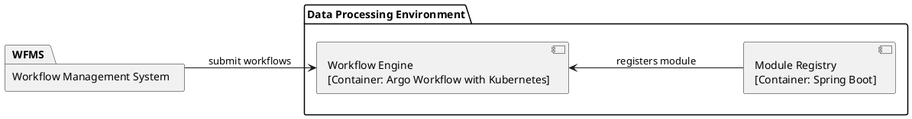

# Argo Workflow

## Overview

**Argo Workflows** serves as the **Workflow Engine** of the Data Processing Environment (DPE) within the DimSum platform, developed in the context of ESA project OHDSA.

The Workflow Engine implemented by Argo Workflows receives the execution requests from the Workflow Management System (WMTS). These workflows are implemented as a collection of Pluggable Acquisition and Processing Modules (PAPM).

Argo Workflows enables the chaining of container-based modules and workflows. The software 'Argo Workflows' is a **Commercial-Of-The-Shelf (COTS)** which consists in a Kubernetes-native workflow engine that orchestrates parallel jobs on a Kubernetes cluster.

## Features

- **Chaining of Container-Based Modules**: Create workflows connecting multiple containerized processes.
- **Seamless Container Interfacing**: Facilitate smooth interaction between containers.
- **Workflow Completion Notifications**: Provide notifications upon workflow completion (planned in a future version of the DimSum platform)
- **Workflow Monitoring and Management**: Monitor and manage workflows.
- **Versatile Workflow Definition Language**: Support Directed Acyclic Graph (DAG) models.
- **Dynamic Resource Allocation**: Allocate resources dynamically.
- **Retry Strategies**: Implement retry strategies for task failures.

## Getting Started

To begin using this project, please refer to the [Installation Manual](./installation_manual.md).

## Documentation

Detailed documentation is available to help you understand and use the project effectively:

- [User Manual](./user_manual.md): A comprehensive guide for end-users on how to use the application.
- [Software Design](./design/sw_design.md): Documentation detailing the API specifications and usage.
- [API Design](./design/rest_api_design.md): Documentation detailing the API specifications and usage.

## API Reference

For a detailed description of the API, see the [API Specifications](./design/rest_api_design.md).

## Configuration and Deployment

Configuration instructions and deployment guides are provided:
- 
- [Installation Manual](./installation_manual.md): comprehensive guidance on how to install and set up Argo Workflows.
- [Helm Charts](./helm_charts.md): Guidelines on using and configuring Helm charts for Kubernetes deployment.

## Examples

Explore practical examples to better understand how to integrate and use the project's features:

- [Example Usage](./examples.md)

