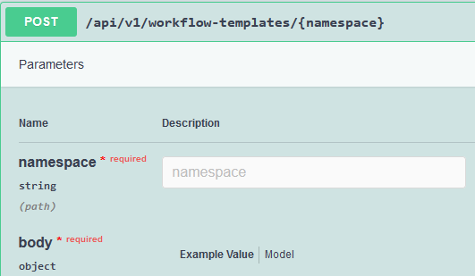
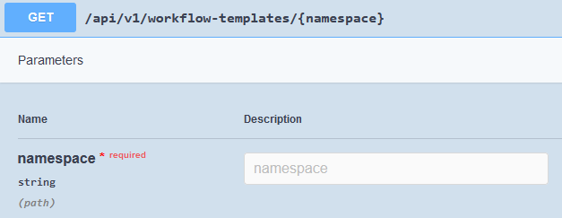
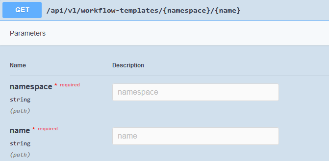

# API Documentation for [Project Name]

## Table of Contents
- [Interface Overview](#interface-overview)
- [Interface Type](#interface-type)
- [Producers and Consumers](#producers-and-consumers)
- [Operations](#operations)
- [Data Model](#data-model)

## Interface Overview
Provide a brief overview of the purpose and functionality of the API, including how it integrates with other systems and services.

## Interface Type
- **Description**: Specify the type of API interface (e.g., REST, GraphQL, SOAP, Message Broker).
- **Communication Protocols**: List the protocols this API supports (e.g., HTTP/HTTPS, AMQP).

## Producers and Consumers
- **Producers**: Identify the systems or services that send data to the API.
- **Consumers**: List the systems or services that receive data from the API.

## Operations
Detail each operation provided by the API, including method names, request and response formats, and a brief description of their functionality.

### Example Operation: GetItem
- **HTTP Method**: `GET`
- **Endpoint**: `/items/{id}`
- **Description**: Retrieves an item by its unique ID.
- **Request Parameters**:
    - `id` (path): The unique identifier for the item.
- **Response**:
    - **Success (200 OK)**:
      ```json
      {
        "id": "item1",
        "name": "Example Item",
        "description": "A sample item in the catalog."
      }
      ```
    - **Error (404 Not Found)**:
      ```json
      {
        "error": "Item not found."
      }
      ```
### Workflow Template creation 
The following operation is used to register a reusable workflow template by providing the target namespace as a path parameter and the workflow template in the request's body.



### List available Workflow Templates
The following operation list the reusable workflow templates already available. This request requires to provide the namespace as a path parameter, other parameters must be provided as query parameters and are optionals parameters used to filter the list returned by this operation.



### Describe Workflow Template
The following operation provide information about a specific workflow template.



### List Workflows
The following operation list all workflows submitted in a specific namespace.


### Submit Workflow
The following operation submit a workflow for execution in the namespace specified.


### Delete Workflow
The following operation deletes a workflow in the namespace specified.


### Retrieve Workflow Status
The following operation retrieves the status of the desired workflow running in the namespace specified.


### Retrieve Workflow Logs
The following operation retrieves the logs of the desired workflow running in the namespace specified. To retrieve logs from the desired step, specify the 'logOptions.container' query parameter with the container name corresponding to the desired step.


## Data Model
Describe the data structures used by the API. Include JSON schema definitions or similar structures to detail the types and formats of data that the API will accept and return.

### Example Data Model: Item

```json
{
  "type": "object",
  "required": ["id", "name"],
  "properties": {
    "id": {
      "type": "string",
      "description": "The unique identifier for the item."
    },
    "name": {
      "type": "string",
      "description": "The name of the item."
    },
    "description": {
      "type": "string",
      "description": "A brief description of the item."
    }
  }
}
