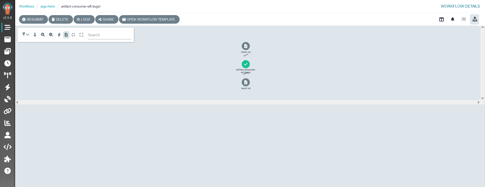

### WEB GUI Tutorial

In this tutorial we will see how we can leverage the graphical user interface to manage workflow templates, submit and monitor workflows.

The first step is to open a web browser and open the url on which your argo workflow web server is exposed. From the Home page you can use the navigation menu displayed on the left to choose the desired section.

In our case we will select the 'Workflow Templates tab'. From this page we can see the different workflow templates available, create new ones, delete old ones,....

After deploying the desired workflow template, you can choose the 'Workflow' page (still from the navigation menu on the left).

From this page, we can see the workflows already submitted, submit a new one, monitor a workflow, delete one,...

Now, if we click on a workflow we can see its status, this section can also help us to monitor a workflow during its execution.

By clicking on the output artifact 'results.txt' we can see its content and download it.

This concludes this tutorial.
You can find more information online on: [Argo Workflow - User Guide](https://argo-workflows.readthedocs.io/en/latest/workflow-concepts/)

