# User Manual for [Project Name]

## Table of Contents
- [Purpose of the Software](#purpose-of-the-software)
- [Operations Environment](#operations-environment)
    - [Hardware Configuration](#hardware-configuration)
    - [Software Configuration](#software-configuration)
- [Operations Manual](#operations-manual)
    - [General](#general)
    - [Set-up and Initialization](#set-up-and-initialization)
    - [Getting Started](#getting-started)
    - [Normal Operations](#normal-operations)
    - [Normal Termination](#normal-termination)
    - [Error Conditions](#error-conditions)
    - [Recover Runs](#recover-runs)
- [Tutorial](#tutorial)

## Purpose of the Software

Argo Workflow is an open-source engine tailored for orchestrating workflows on Kubernetes, enabling users to define, manage, and execute tasks in containers.

## Operations Environment

Argo Workflow is executed on a Kubernetes cluster, on which it orchestrates the containers required fo executing the desired workflows.

### Hardware Configuration

**TBC**
Provide a block diagram illustrating the main hardware components of the system, including required memory, storage, and peripherals like printers.

> Note: section might be omitted or restricted to requirements

### Software Configuration
**TBC**
Outline the main software components through a block diagram, including operating systems, utilities, and other supporting systems.

> Note: might be restricted to description of docker environment

## Operations Manual

### General

Detail the operational organization, schedules, elementary operations at the site, and responsibilities.

> Note: Elementary operations

### Set-up and Initialization

Describe procedures for user identification, authorization, installation, configuration, and initial setup tasks.

The set-up procedures are described in the [Installation Manual](./installation_manual.md).

### Getting Started


1. Ensure Kubectl configuration points to the desired Kubernetes cluster.
2. Open a new terminal.


### Normal Operations

From ARGO CLI, a non-exhaustive list of operations are available. 

#### Workflow Template operations
- List Workflow templates: `argo template list`
- Create Workflow template: `argo -n <k8s-namespace> template create <workflow-template-definition.yaml>`
- Delete workflow template: `argo -n <k8s-namespace> template delete <workflow-template-name>`

#### Workflow operations
- List Workflows: `argo -n <k8s-namespace> list`
- Submit a workflow: `argo -n <k8s-namespace> submit <workflow-definition.yaml>`
- Get status of a workflow: `argo -n <k8s-namespace> get <workflow-name>`
- Retrieve logs of a workflow: `argo -n <k8s-namespace> logs <workflow-name>`
- Delete a workflow: `argo -n <k8s-namespace> delete <workflow-name>`

### Normal Termination

Describe how users can cease or interrupt software use and verify if the termination has been normal.

>NOTE: optional

### Error Conditions

Detail common error conditions, detection methods, and troubleshooting steps.

### Recover Runs

Provide procedures for restarting or recovering from errors and maintaining continuity during emergencies.

> NOTE: if relevant

## Tutorial

> NOTE: Introduce how to use the software and what it accomplishes, tailored for both novices and experts.
A welcoming introduction to the software, setting the stage for its use.
Describe a typical task using graphical illustrations and diagrams to show the actions performed by the user.

This tutorial covers how we can use ARGO CLI to register a workflow template, submit a workflow and monitor its status before retrieving logs and results.

### Register a Workflow template
As we want to register a Workflow template, the first step would be to defined one.
```yaml
apiVersion: argoproj.io/v1alpha1
kind: WorkflowTemplate
metadata:
name: hello-world-wft
spec:
entrypoint: whalesay
templates:
- name: whalesay
inputs:
parameters:
- name: message
container:
image: docker/whalesay
command: [ cowsay ]
args: ["{{inputs.parameters.message}}"]
```
See: [hello-world-wf-template.yml](../examples/hello-world-template/hello-world-wf-template.yml)

Once we have defined a workflow template in a YAML file, we can register this template by calling ARGO CLI:
In this tutorial, we will use the template located at: examples/hello-world-template/hello-world-wf-template.yml

To proceed, open a new terminal windows at the root of this project.
Then execute the following command:
```
argo -n <k8s-namespace> template create examples/hello-world-template/hello-world-wf-template.yml
```
Expected output:

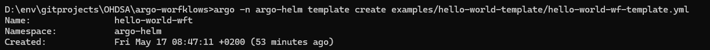

After the workflow template registration, we should see the template in the list, with the following command:
```
argo -n <k8s-namespace> template list
```
Expected output:

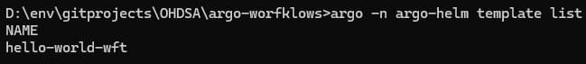

### Submit a workflow

As for the workflow template, the workflow can be defined in a yaml file.
```yaml
apiVersion: argoproj.io/v1alpha1
kind: Workflow
metadata:
  generateName: hello-world-workflow-
spec:
  arguments:
    parameters:
      - name: message
        value: This is a whale message # Message to pass to the template
  # Reference the WorkflowTemplate
  workflowTemplateRef:
    name: hello-world-wft
```
See: [hello-world-wf.yml](../examples/hello-world-template/hello-world-wf.yml)

Once we have defined a workflow in a YAML file, we can submit it by calling ARGO CLI.
In this tutorial, we will use the workflow located at: examples/hello-world-template/hello-world-wf.yml

To proceed, open a new terminal windows at the root of this project.
Then execute the following command:
```
argo -n <k8s-namespace> submit examples/hello-world-template/hello-world-wf.yml
```
Expected output:

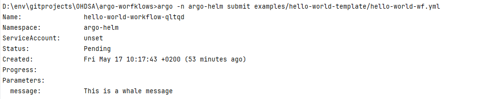

### Monitor a workflow

In order to monitor a submitted workflow, we can retrieve its status with the following command:
```
argo -n <k8s-namespace> get <workflow-name>
```
Note that `<workflow-name>` correspond to the name of the workflow (available in the response to the submit workflow operation). In this example, it corresponds to: hello-world-workflow-qltqd

Expected output:

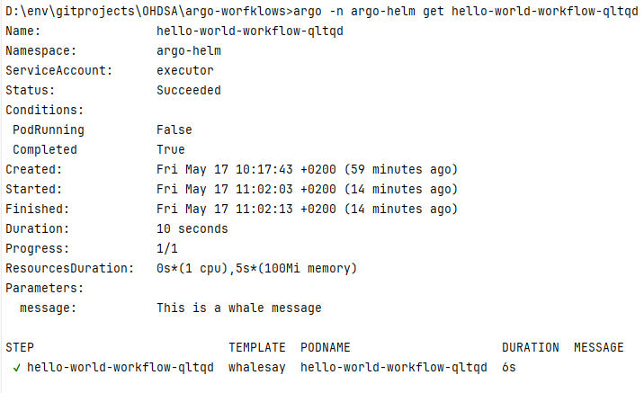

In the response, we can observe that `Status` is `Succeeded`. meaning that the execution of this workflow terminated successfully.

To retrieve the logs associated with this workflow, one can use the following command:
```
argo -n <k8s-namespace> get <workflow-name>
```

Expected output:

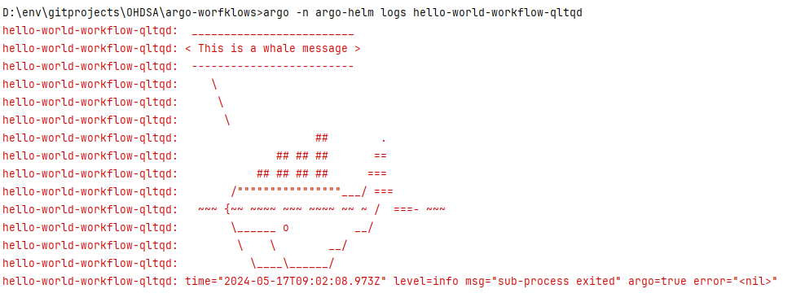

## REST Tutorial

In this section, we will see how to use the REST API for managing workflows.
For more information on those operations,see API design documentation: [API](./design/api_design.md)

> Authentication is not covered in this tutorial.

Postman collection of requests used in this tutorial: [Postman DEMO Collection](./user_manual_resources/argo_workflow_demo.postman_collection.json)

Open the Postman collection HELLOWOLRD-TEMPLATE-EXAMPLE

### Register a Workflow template

In this tutorial, we will use the template located at: examples/hello-world-template/hello-world-wf-template.yml
See: [hello-world-wf-template.yml](../examples/hello-world-template/hello-world-wf-template.yml)

Once we have defined a workflow template in a YAML file, we can register this template by calling the RESt API.

Open the Postman collection and select the request located in Template/ Create Workflow Template:


Expected Output:
**TBD**: Add screenshot.

### Submit a Workflow

Open the Postman request located in Workflow / Submit Workflow:


Expected Output:
**TBD**: Add screenshot.

### Monitor a workflow

The REST API provide an operation to retrieve the status of a Workflow including the status of the pods deployed on the Kubernetes cluster.

Open the Postman collection and select the request located in Workflow/ Get Status:


Expected output:
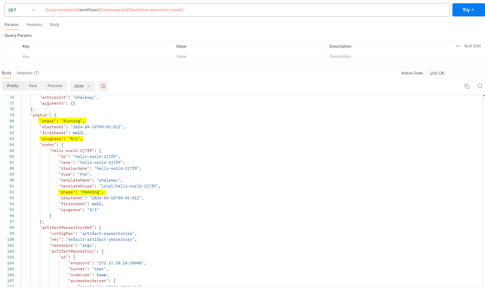

To retrieve the logs associated with a workflow, a REST Operation also exists.

Open the Postman collection and select the request located in Workflow/ Get LOGS:


Expected output:
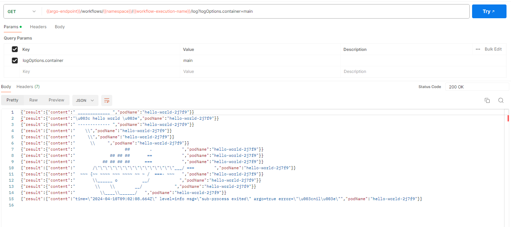


## Artifact Tutorial

Requirements:
- This tutorial requires that your argo workflow installation uses a default artifact repository (see the [installation manual](installation_manual.md) for more information on this)
- It also requires that a bucket named 'test' is presetn at the root of your artifact repository (S3 storage).

This tutorial covers how we can consume and produce artifacts in a workflow. 
For this purpose, we will use the artifact-consumer example located in [examples/artifact/consumer](../examples/artifact-consumer)

The workflow Template is as follows:
```yaml
apiVersion: argoproj.io/v1alpha1
kind: WorkflowTemplate
metadata:
  name: artifact-consumer-wft
spec:
  entrypoint: process-artifact
  templates:
    - name: process-artifact
      inputs:
        parameters:
          - name: source-path
          - name: target-path
        artifacts:
          - name: input-file
            path: /tmp/input-file
            s3:
              bucket: test
              key: "{{inputs.parameters.source-path}}"
      outputs:
        artifacts:
          - name: output-file
            path: /tmp/output-file.txt
            archive:
              none: { }
            s3:
              key: "{{inputs.parameters.target-path}}"
      container:
        image: docker/whalesay
        command: [ sh, -c ]
        args: ["ls -lh /tmp/input-file >> /tmp/output-file.txt"]
```
See: [examples/artifact/consumer/artifact-consumer-wf-template.yml](../examples/artifact-consumer/artifact-consumer-wf-template.yml)

This workflow template defines an input artifact, which references a bucket 'test' and the key is provided as a parameter.
```yaml
artifacts:
          - name: input-file
            path: /tmp/input-file
            s3:
              bucket: test
              key: "{{inputs.parameters.source-path}}"
```


It also defines an output artifact, which key is also provided as a parameter:
```yaml
artifacts:
          - name: output-file
            path: /tmp/output-file.txt
            archive:
              none: { }
            s3:
              key: "{{inputs.parameters.target-path}}"
```

The first step, is to register this workflow template:
```
argo -n <k8s-namespace> template create examples/artifact-consumer/artifact-consumer-wf-template.yml
```

Expected output:

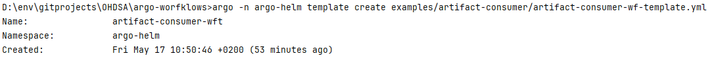

After registering the workflow template, we can submit a workflow. 
This workflow will have to define the key used for the input (source-path) and output (target-path) artifacts.
```yaml
apiVersion: argoproj.io/v1alpha1
kind: Workflow
metadata:
  generateName: artifact-consumer-wft-
spec:
  arguments:
    parameters:
      - name: source-path
        value: lorem.txt # The specific key for the S3 input object
      - name: target-path
        value: result.txt # The specific key where the S3 output object will be written

  # Reference the WorkflowTemplate
  workflowTemplateRef:
    name: artifact-consumer-wft
```
See: [examples/artifact/consumer/artifact-consumer-wf.yml](../examples/artifact-consumer/artifact-consumer-wf.yml)

Submit the workflow for execution with the following command:
```
argo -n <k8s-namespace> submit examples/artifact-consumer/artifact-consumer-wf.yml
```

Expected output:

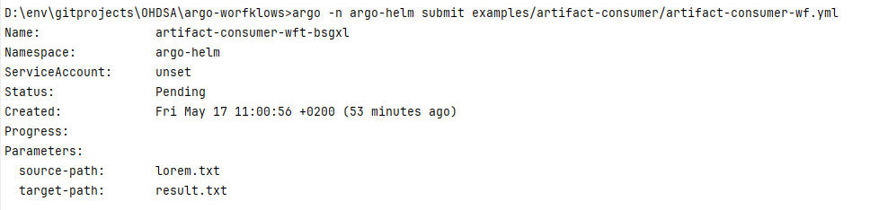


To monitor the workflow execution progress, use the same commands as in the basic tutorial.

## WEB GUI Tutorial

In this tutorial we will see how we can leverage the graphical user interface to manage workflow templates, submit and monitor workflows.

The first step is to open a web browser and open the url on which your argo workflow web server is exposed. From the Home page you can use the navigation menu displayed on the left to choose the desired section.


In our case we will select the 'Workflow Templates tab'. From this page we can see the different workflow templates available, create new ones, delete old ones,....

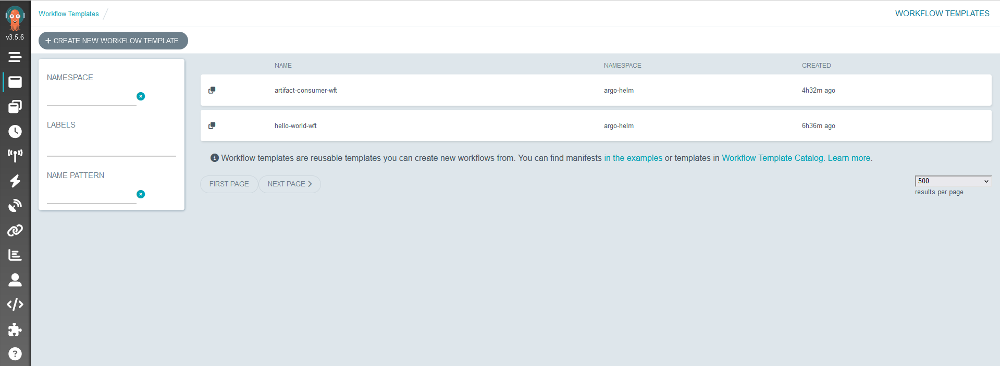

After deploying the desired workflow template, you can choose the 'Workflow' page (still from the navigation menu on the left).

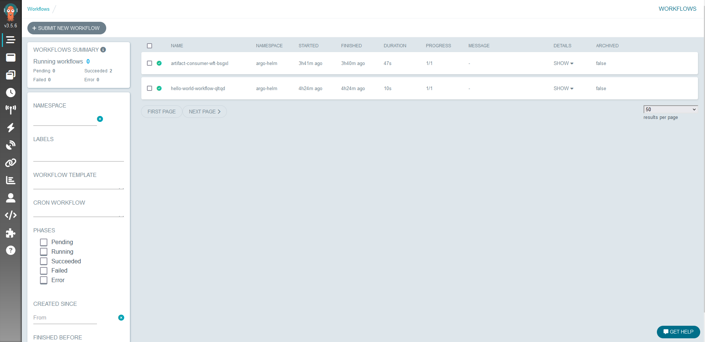

From this page, we can see the workflows already submitted, submit a new one, monitor a workflow, delete one,...

Now, if we click on a workflow we can see its status, this section can also help us to monitor a workflow during its execution.


By clicking on the output artifact 'results.txt' we can see its content and download it.


This concludes this tutorial. 
You can find more information online on: [Argo Workflow - User Guide](https://argo-workflows.readthedocs.io/en/latest/workflow-concepts/)
