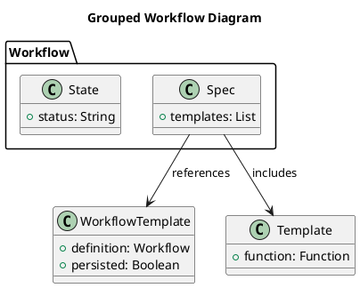
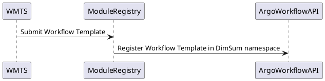
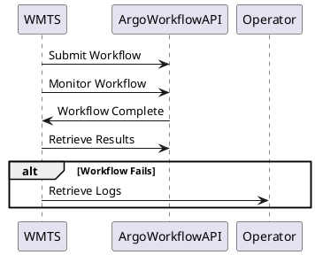
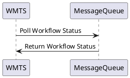

# User Manual for Argo Workflow

## Purpose of the Software

Argo Workflow is an open-source engine tailored for orchestrating workflows on Kubernetes, enabling users to define, manage, and execute tasks in containers.

## Operations Environment

Argo Workflow is executed on a Kubernetes cluster, on which it orchestrates the containers required fo executing the desired workflows.

### Hardware Configuration

Argo Workflow requires a Kubernetes cluster to operate effectively. 

## Operations Manual

### Set-up and Initialization

The set-up procedures are described in the [Installation Manual](./installation_manual.md).

### Normal Operations

The normal operations of the Argo Workflow engine are thoroughly documented on the [official Argo Workflows documentation site](https://argo-workflows.readthedocs.io/en/latest/), with detailed references to various [operational fields](https://argo-workflows.readthedocs.io/en/latest/fields/). 

The resources below aim to complement the official documentation with guidance for performing activities expected within the DimSum platform:

- **Workflow Design Manual**: This manual explains concepts and provides guidance on designing workflows that include features relevant to the platform, such as workflow templates, artefacts, and retry strategies. [Workflow Design Manual](workflow_design_manual.md)
- **API Design**: This section describes the operations from the REST API specification expected to be used by the Workflow Management System (WMTS) for submitting workflows. [API Design](design/rest_api_design.md)

The subsection below provides a summary of the operations and sequences expected to be used by the WMTS. Additionally, a few [tutorials](#Tutorials) are provided for testing purposes to facilitate the learning of Argo Workflows.

#### Argo Workflow Key Concepts

In the context of Argo Workflows, three key concepts are essential: **Workflow**, **template**, and **Workflow Template**.

- **Workflow**: A structured sequence of tasks that defines the steps to be executed. It includes a specification (`spec`) of the tasks, a current status (`state`), and may reference a `WorkflowTemplate`.
- **template**: A task within a workflow that acts as a function or method.
- **Workflow Template**: A predefined definition of a workflow that can be persisted, submitted, or referenced within other workflows.

#### DimSum Platform Main Operations

This section outlines the operations expected to be executed by the Workflow Management System (WMTS) in the DimSum platform. The process is divided into three parts: registration, execution, and status polling.

##### Registration of the Workflow Template

1. The WMTS submits the Argo Workflow Template to the Module Registry microservice.
2. The Module Registry registers the workflow template in the DimSum namespace using the Argo Workflow API.

##### Execution of the Workflow

1. The WMTS submits the Workflow using the REST API.
2. The WMTS monitors the Workflow until it is complete.
3. Upon completion, the WMTS retrieves the results.
4. If the execution fails, the WMTS retrieves logs from an operator.

##### Workflow Notifications

Argo Workflows does not natively support notification mechanisms for status updates, except through implementing a custom container in an exit handler to handle such notifications. However, this functionality can be considered in phase 2 of the project.

See [Workflow Notifications Documentation](https://argo-workflows.readthedocs.io/en/latest/workflow-notifications/) for additional details.

### Normal Termination

To cease or interrupt the use of Argo Workflow, users can terminate their workflows through the Argo CLI or Argo UI. Using the Argo CLI, the `argo stop` or `argo terminate` commands can be employed to stop or terminate a workflow, respectively. Additionally, the Argo UI provides an intuitive interface to manage and halt workflows.

To verify if the termination has been normal, users should check the status of the workflow. A normally terminated workflow will have a status of `Succeeded` or `Failed`, indicating that the workflow has completed its execution or encountered an error during the process. Users can inspect the workflow status via the Argo CLI with the `argo get` command or through the Argo UI.

### Error Conditions

Common error conditions in Argo Workflow include:

1. **Workflow Fails to Start**: This may be due to incorrect workflow definitions or missing dependencies. Detection methods include checking the Argo CLI or UI for error messages indicating validation issues.

   **Troubleshooting Steps**:
  - Verify the workflow YAML file for syntax errors.
  - Ensure all required parameters and artifacts are correctly defined.
  - Use the `argo lint` command to validate the workflow definition.

2. **Pod Failures**: Pods may fail to start or run due to resource constraints, image pull errors, or misconfigurations. Detection involves monitoring pod status in the Kubernetes dashboard or using the Argo CLI.

   **Troubleshooting Steps**:
  - Check pod logs using `kubectl logs <pod-name>` for detailed error messages.
  - Ensure the container images are accessible and correctly specified.
  - Verify resource requests and limits to ensure the cluster can accommodate the pod.

3. **Timeouts**: Workflows or specific steps may time out if they exceed the allotted execution time. Detection methods include checking the workflow status for timeout errors.

   **Troubleshooting Steps**:
  - Review and adjust the timeout settings in the workflow definition.
  - Optimize the workflow steps to reduce execution time.
  - Ensure external services or dependencies are responsive and not causing delays.

4. **Permission Denied Errors**: These errors occur when the workflow does not have the necessary permissions to perform certain actions. Detection involves examining the error messages related to access issues.

   **Troubleshooting Steps**:
  - Verify the service account permissions and roles assigned to the workflow.
  - Update the role-based access control (RBAC) settings to grant the required permissions.
  - Check and correct any file or directory permissions within the workflow.

5. **Resource Quota Exceeded**: Workflows may fail if they exceed the assigned resource quotas in the cluster. Detection involves checking for resource-related error messages in the workflow status.

   **Troubleshooting Steps**:
  - Review the resource quotas assigned to the namespace and adjust if necessary.
  - Optimize workflow resource usage to stay within the quota limits.
  - Consult with the cluster administrator to request increased resource allocations if needed.

### Recover Runs

In the event of workflow failures or interruptions, Argo Workflows provides mechanisms to restart or recover runs, ensuring continuity and minimizing downtime.

1. **Retry Failed Steps**: Argo allows users to retry failed steps within a workflow. This can be configured in the workflow YAML by specifying the `retryStrategy`. Users can define the number of retries and the backoff strategy.

   **Procedure**:
  - Edit the workflow definition to include a `retryStrategy` for the relevant steps.
  - Resubmit the workflow using the `argo submit` command with the updated YAML file.

2. **Resume Suspended Workflows**: If a workflow is manually or automatically suspended, it can be resumed using the Argo CLI.

   **Procedure**:
  - Use the `argo resume <workflow-name>` command to resume a suspended workflow.
  - Verify the workflow status to ensure it continues from the point of suspension.

3. **Resubmit Failed Workflows**: Entire workflows that have failed can be resubmitted. This can be useful if the failure was due to transient issues or if changes have been made to the environment.

   **Procedure**:
  - Identify the failed workflow using the `argo list` command.
  - Resubmit the workflow using the `argo resubmit <workflow-name>` command.
  - Monitor the workflow status to ensure it runs to completion.

4. **Workflow Archiving and Retrieval**: Argo Workflows can be configured to archive completed workflows. Archived workflows can be retrieved and resubmitted if needed.

   **Procedure**:
  - Ensure workflow archiving is enabled in the Argo configuration.
  - Retrieve archived workflows using the `argo archive get <workflow-name>` command.
  - Resubmit the archived workflow using the `argo submit` command.

5. **Handling Emergency Situations**: In emergencies, such as cluster failures or critical resource shortages, maintaining workflow continuity is crucial.

   **Procedure**:
  - Implement backup and restore strategies for the Argo Workflow controller and associated databases.
  - Utilize high-availability (HA) configurations for critical components to minimize downtime.
  - Regularly test disaster recovery plans to ensure workflows can be recovered quickly.

## Tutorials

The following tutorials are provided for testing purposes to facilitate the learning of Argo Workflows:

* [CLI Tutorial](tutorial_cli.md): Offers a brief overview of the main operations of the Argo CLI, a command-line interface that allows users to manage and interact with their workflows efficiently.
* [REST API Tutorial](tutorial_rest.md): Demonstrates how to interact with the Argo Workflows through REST API calls, providing examples of common operations such as submitting, monitoring, and managing workflows.
* [GUI Tutorial](tutorial_gui.md): Guides users through the graphical user interface of Argo Workflows, showcasing how to visually design, manage, and monitor workflows using the web-based interface.
