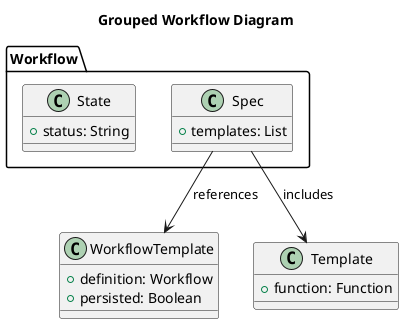
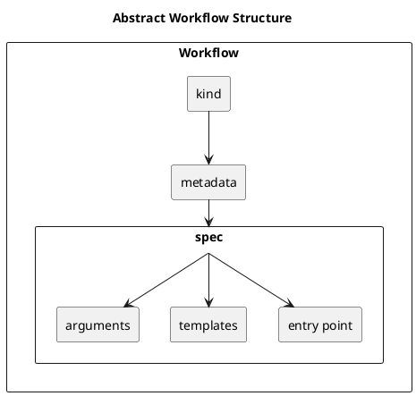
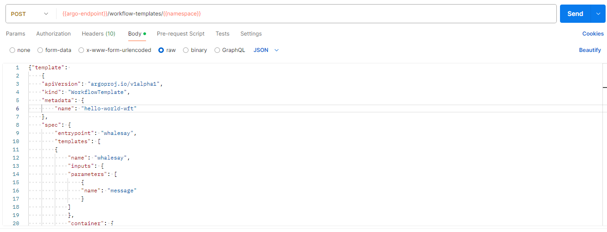
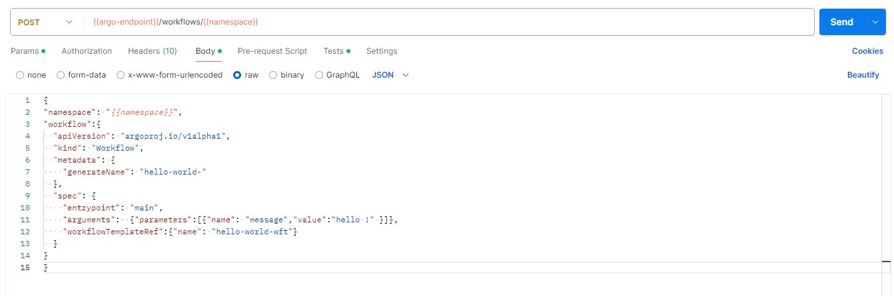

# User Manual for Argo Workflow

## Table of Contents
- [Purpose of the Software](#purpose-of-the-software)
- [Operations Environment](#operations-environment)
  - [Hardware Configuration](#hardware-configuration)
  - [Software Configuration](#software-configuration)
- [Operations Manual](#operations-manual)
  - [General](#general)
  - [Set-up and Initialization](#set-up-and-initialization)
  - [Getting Started](#getting-started)
  - [Normal Operations](#normal-operations)
    - [Workflow Template operations](#workflow-template-operations)
    - [Workflow operations](#workflow-operations)
  - [Normal Termination](#normal-termination)
  - [Error Conditions](#error-conditions)
  - [Recover Runs](#recover-runs)
- [Tutorial](#tutorial)
  - [Argo CLI](#argo-cli)
    - [Register a Workflow template](#register-a-workflow-template)
    - [Submit a workflow](#submit-a-workflow)
    - [Monitor a workflow](#monitor-a-workflow)
  - [REST Tutorial](#rest-tutorial)
    - [Register a Workflow template](#register-a-workflow-template-1)
    - [Submit a Workflow](#submit-a-workflow-1)
    - [Monitor a workflow](#monitor-a-workflow-1)
  - [Artifact Tutorial](#artifact-tutorial)
  - [DAG Tutorial](#dag-tutorial)
  - [WEB GUI Tutorial](#web-gui-tutorial)


## Purpose of the Software

Argo Workflow is an open-source engine tailored for orchestrating workflows on Kubernetes, enabling users to define, manage, and execute tasks in containers.

## Operations Environment

Argo Workflow is executed on a Kubernetes cluster, on which it orchestrates the containers required fo executing the desired workflows.

### Hardware Configuration

Argo Workflow requires a Kubernetes cluster to operate effectively. 

## Operations Manual


### Set-up and Initialization

The set-up procedures are described in the [Installation Manual](./installation_manual.md).

#### Installing Argo CLI

The Argo CLI is a command-line interface tool that allows users to interact with Argo Workflows. Follow the steps below to install the Argo CLI:

1. **Download the latest Argo CLI release**:

   Visit the [Argo Workflows GitHub releases page](https://github.com/argoproj/argo-workflows/releases) and download the appropriate binary for your operating system.

   `Example: curl -sLO https://github.com/argoproj/argo-workflows/releases/latest/download/argo-linux-amd64.gz`

2. **Unzip the downloaded binary**:

   Unzip the downloaded binary.

   `Example: gunzip argo-linux-amd64.gz`

3. **Make the binary executable**:

   Make the unzipped binary executable.

   `Example: chmod +x argo-linux-amd64`

4. **Move the binary to your PATH**:

   Move the executable binary to a directory included in your system's `PATH`.

   `Example: mv argo-linux-amd64 /usr/local/bin/argo`

5. **Verify the installation**:

   Confirm that the Argo CLI has been installed correctly by running the version command.

   `Example: argo version`


### Getting Started


1. Ensure Kubectl configuration points to the desired Kubernetes cluster.
2. Open a new terminal.


### Normal Operations

The normal operations of the Argo Workflow engine are thoroughly documented on the [official Argo Workflows documentation site](https://argo-workflows.readthedocs.io/en/latest/), with detailed references to various operational fields available [here](https://argo-workflows.readthedocs.io/en/latest/fields/). This section offers a brief overview of the main operations of the Argo CLI, a command-line interface that allows users to manage and interact with their workflows efficiently.

The interface (API) is described in detail in the [API Specifications](./api/openapi.yaml) and tutorial is provided in below section [REST Tutorial](#rest-tutorial).

For various examples on how to use Argo Workflow within the context of the Dimsum platform, refer to the [Tutorial](#Tutorial) section.


#### Workflow Template operations
- List Workflow templates: `argo template list`
- Create Workflow template: `argo -n <k8s-namespace> template create <workflow-template-definition.yaml>`
- Delete workflow template: `argo -n <k8s-namespace> template delete <workflow-template-name>`

#### Workflow operations
- List Workflows: `argo -n <k8s-namespace> list`
- Submit a workflow: `argo -n <k8s-namespace> submit <workflow-definition.yaml>`
- Get status of a workflow: `argo -n <k8s-namespace> get <workflow-name>`
- Retrieve logs of a workflow: `argo -n <k8s-namespace> logs <workflow-name>`
- Delete a workflow: `argo -n <k8s-namespace> delete <workflow-name>`

### Normal Termination

To cease or interrupt the use of Argo Workflow, users can terminate their workflows through the Argo CLI or Argo UI. Using the Argo CLI, the `argo stop` or `argo terminate` commands can be employed to stop or terminate a workflow, respectively. Additionally, the Argo UI provides an intuitive interface to manage and halt workflows.

To verify if the termination has been normal, users should check the status of the workflow. A normally terminated workflow will have a status of `Succeeded` or `Failed`, indicating that the workflow has completed its execution or encountered an error during the process. Users can inspect the workflow status via the Argo CLI with the `argo get` command or through the Argo UI.

### Error Conditions

Common error conditions in Argo Workflow include:

1. **Workflow Fails to Start**: This may be due to incorrect workflow definitions or missing dependencies. Detection methods include checking the Argo CLI or UI for error messages indicating validation issues.

   **Troubleshooting Steps**:
  - Verify the workflow YAML file for syntax errors.
  - Ensure all required parameters and artifacts are correctly defined.
  - Use the `argo lint` command to validate the workflow definition.

2. **Pod Failures**: Pods may fail to start or run due to resource constraints, image pull errors, or misconfigurations. Detection involves monitoring pod status in the Kubernetes dashboard or using the Argo CLI.

   **Troubleshooting Steps**:
  - Check pod logs using `kubectl logs <pod-name>` for detailed error messages.
  - Ensure the container images are accessible and correctly specified.
  - Verify resource requests and limits to ensure the cluster can accommodate the pod.

3. **Timeouts**: Workflows or specific steps may time out if they exceed the allotted execution time. Detection methods include checking the workflow status for timeout errors.

   **Troubleshooting Steps**:
  - Review and adjust the timeout settings in the workflow definition.
  - Optimize the workflow steps to reduce execution time.
  - Ensure external services or dependencies are responsive and not causing delays.

4. **Permission Denied Errors**: These errors occur when the workflow does not have the necessary permissions to perform certain actions. Detection involves examining the error messages related to access issues.

   **Troubleshooting Steps**:
  - Verify the service account permissions and roles assigned to the workflow.
  - Update the role-based access control (RBAC) settings to grant the required permissions.
  - Check and correct any file or directory permissions within the workflow.

5. **Resource Quota Exceeded**: Workflows may fail if they exceed the assigned resource quotas in the cluster. Detection involves checking for resource-related error messages in the workflow status.

   **Troubleshooting Steps**:
  - Review the resource quotas assigned to the namespace and adjust if necessary.
  - Optimize workflow resource usage to stay within the quota limits.
  - Consult with the cluster administrator to request increased resource allocations if needed.


### Recover Runs

In the event of workflow failures or interruptions, Argo Workflows provides mechanisms to restart or recover runs, ensuring continuity and minimizing downtime.

1. **Retry Failed Steps**: Argo allows users to retry failed steps within a workflow. This can be configured in the workflow YAML by specifying the `retryStrategy`. Users can define the number of retries and the backoff strategy.

   **Procedure**:
  - Edit the workflow definition to include a `retryStrategy` for the relevant steps.
  - Resubmit the workflow using the `argo submit` command with the updated YAML file.

2. **Resume Suspended Workflows**: If a workflow is manually or automatically suspended, it can be resumed using the Argo CLI.

   **Procedure**:
  - Use the `argo resume <workflow-name>` command to resume a suspended workflow.
  - Verify the workflow status to ensure it continues from the point of suspension.

3. **Resubmit Failed Workflows**: Entire workflows that have failed can be resubmitted. This can be useful if the failure was due to transient issues or if changes have been made to the environment.

   **Procedure**:
  - Identify the failed workflow using the `argo list` command.
  - Resubmit the workflow using the `argo resubmit <workflow-name>` command.
  - Monitor the workflow status to ensure it runs to completion.

4. **Workflow Archiving and Retrieval**: Argo Workflows can be configured to archive completed workflows. Archived workflows can be retrieved and resubmitted if needed.

   **Procedure**:
  - Ensure workflow archiving is enabled in the Argo configuration.
  - Retrieve archived workflows using the `argo archive get <workflow-name>` command.
  - Resubmit the archived workflow using the `argo submit` command.

5. **Handling Emergency Situations**: In emergencies, such as cluster failures or critical resource shortages, maintaining workflow continuity is crucial.

   **Procedure**:
  - Implement backup and restore strategies for the Argo Workflow controller and associated databases.
  - Utilize high-availability (HA) configurations for critical components to minimize downtime.
  - Regularly test disaster recovery plans to ensure workflows can be recovered quickly.

## Tutorial

### Argo Workflow Concepts

#### Concepts and Definitions

In the context of Argo Workflows, three key concepts are essential: **Workflow**, **template**, and **Workflow Template**.

- **Workflow**: A structured sequence of tasks that defines the steps to be executed. It includes a specification (`spec`) of the tasks, a current status (`state`), and may reference a `WorkflowTemplate`.
- **template**: A task within a workflow that acts as a function or method.
- **Workflow Template**: A predefined definition of a workflow that can be persisted, submitted, or referenced within other workflows.



#### Workflow Structure

A **Workflow** is composed of several key components:

- **kind**: Defines the type or category of the workflow.
- **metadata**: Contains metadata information about the workflow, such as name, namespace, labels, and annotations.
- **spec**: The specification of the workflow, which includes detailed definitions of the workflow's behavior and structure.
    - **entrypoint**: The starting point or main task of the workflow.
    - **templates**: A collection of tasks or functions to be executed within the workflow.
    - **arguments**: Parameters or inputs required for the workflow to execute.



The following example illustrates a very simple workflow:

```yaml
kind: Workflow
apiVersion: argoproj.io/v1alpha1
metadata:
  generateName: hello-world-
spec:
  entrypoint: whalesay
  templates:
    - name: whalesay
      container:
        image: docker/whalesay
        command: [ cowsay ]
        args: [ "hello world" ]
```

#### Templates Structure

In the context of a Workflow, the `templates` section defines the tasks to be executed. Each template can have the following components:

- **name**: The name of the template. This is a unique identifier for the template within the workflow.
- **inputs**: (Optional) Specifies the inputs required by the template. This can include parameters, artifacts, and other input resources.
- **outputs**: (Optional) Specifies the outputs produced by the template. This can include parameters, artifacts, and other output resources.
- **type**: (Optional) Indicates the type of template. Common types include:
    - `container`: Specifies a container to run.
    - `steps`: Defines a set of sequential or parallel steps to be executed.
    - `dag`: Defines a Directed Acyclic Graph of tasks, allowing more complex workflows.
    - `resource`: Manages Kubernetes resources as part of the workflow.
    - `script`: Executes a script.

The following example shows the details of the container template with inputs and outputs.

```yaml
templates:
  - name: whalesay
    container:
      image: docker/whalesay
      command: [ cowsay ]
      args: [ "hello world" ]
    inputs:
      parameters:
        - name: message
          value: "hello world"
    outputs:
      artifacts:
        - name: output
          path: /path/to/output
```          

In this example, the whalesay template is of type container. It specifies the container image, command, and arguments to run. The template also defines an input parameter (message) and an output artifact (output).

#### Workflow Parameter and Argument

It is important to understand the distinction between parameters and arguments:

- **Input Parameter**: This is a definition of the inputs required by a task or function. For example, in a function definition `addFour(int a) {}`, `a` is an input parameter.
- **Output Parameter**: This is a definition of the output produced by a task or function. For example, in a function definition `int addFour(…) {}`, the function returns an integer, which is an output parameter.
- **Argument**: This is the actual value provided to a parameter when a task or function is executed. For instance, if you call the function `addFour(4)`, the value `4` is the argument.

The following example demonstrates how input parameters and arguments are used within a workflow:

```yaml
spec:
  entrypoint: whalesay
  arguments:
    parameters:
      - name: message
        value: hello world
  templates:
    - name: whalesay
      inputs:
        parameters:
          - name: message
      container:
        image: docker/whalesay
        command: [ cowsay ]
        args: [ "{{inputs.parameters.message}}" ]
```

In this example:

- The `arguments` section at the `spec` level provides live parameter values. Here, the parameter named `message` is given the value `"hello world"`.
- The `templates` section defines a template named `whalesay`. This template has an input parameter named `message`.
- Within the container specification, the command to be run (`cowsay`) uses the argument provided to the `message` parameter (`"hello world"`), which is referenced as `{{inputs.parameters.message}}`.


## WorkflowTemplate

A **WorkflowTemplate** is a reusable definition of a workflow that can be registered, persisted, and referenced by other workflows. This template defines a workflow's structure and behavior, making it possible to standardize and reuse workflow definitions across multiple workflows.

### Key Components

- **entrypoint**: The main task or starting point of the workflow. This defines the initial action to be executed when the workflow starts.
- **inputs**: Parameters required by the entrypoint. These parameters define what inputs are necessary for the workflow to run.
- **outputs**: Parameters produced by the entrypoint. These parameters define the results or outputs generated by the workflow.

### External Interface

The entrypoint, along with its input and output parameters, defines the external interface of the registerable `WorkflowTemplate`. This interface specifies what inputs are needed and what outputs will be produced, making it possible for other workflows to interact with this template.

When a workflow references a `WorkflowTemplate`, it must provide the required parameter values as arguments. This ensures that all necessary inputs are available for the workflow to execute correctly.


### Example WorkflowTemplate


### Argo CLI

This tutorial demonstrates how to use the Argo CLI to register a workflow template, submit a workflow, monitor its status, and retrieve logs and results.

#### Register a Workflow template

To register a workflow template, we first need to define one.

```yaml
apiVersion: argoproj.io/v1alpha1
kind: WorkflowTemplate
metadata:
name: hello-world-wft
spec:
entrypoint: whalesay
templates:
- name: whalesay
inputs:
parameters:
- name: message
container:
image: docker/whalesay
command: [ cowsay ]
args: ["{{inputs.parameters.message}}"]
```

See: [hello-world-wf-template.yml](../examples/hello-world-template/hello-world-wf-template.yml)

After defining a workflow template in a YAML file, we can register it using the Argo CLI. To proceed, open a new terminal window at the root of this project and execute the following command:

```
argo -n <k8s-namespace> template create examples/hello-world-template/hello-world-wf-template.yml
```

After registering the workflow template, verify its registration with the following command:
```
argo -n <k8s-namespace> template list
```

#### Submit a workflow

Define the workflow in a YAML file as shown below.

```yaml
apiVersion: argoproj.io/v1alpha1
kind: Workflow
metadata:
  generateName: hello-world-workflow-
spec:
  arguments:
    parameters:
      - name: message
        value: This is a whale message # Message to pass to the template
  # Reference the WorkflowTemplate
  workflowTemplateRef:
    name: hello-world-wft
```
See: [hello-world-wf.yml](../examples/hello-world-template/hello-world-wf.yml)

Once we have defined a workflow in a YAML file, we can submit it by calling ARGO CLI. To proceed, open a new terminal windows at the root of this project. Then execute the following command:

```
argo -n <k8s-namespace> submit examples/hello-world-template/hello-world-wf.yml
```

#### Monitor a workflow

In order to monitor a submitted workflow, we can retrieve its status with the following command:
```
argo -n <k8s-namespace> get <workflow-name>
```
Note that `<workflow-name>` correspond to the name of the workflow (available in the response to the submit workflow operation). In this example, it corresponds to: hello-world-workflow-qltqd

In the response, we can observe that `Status` is `Succeeded`. meaning that the execution of this workflow terminated successfully.

To retrieve the logs associated with this workflow, one can use the following command:
```
argo -n <k8s-namespace> get <workflow-name>
```

### REST Tutorial

In this section, we will see how to use the REST API for managing workflows.
For more information on those operations,see API design documentation: [API](./design/api_design.md)

> Note: Authentication aspects are not covered in this tutorial. See https://argo-workflows.readthedocs.io/en/latest/argo-server-auth-mode/

Postman collection of requests used in this tutorial: [Postman DEMO Collection](images/argo_workflow_demo.postman_collection.json)

Open the Postman collection HELLOWOLRD-TEMPLATE-EXAMPLE

#### Register a Workflow template

In this tutorial, we will use the template located at [hello-world-wf-template.yml](../examples/hello-world-template/hello-world-wf-template.yml)

Once we have defined a workflow template in a YAML file, we can register this template by calling the REST API.

Open the Postman collection and select the request located in Template/ Create Workflow Template:



#### Submit a Workflow

Open the Postman request located in Workflow / Submit Workflow:




#### Monitor a workflow

The REST API provide an operation to retrieve the status of a Workflow including the status of the pods deployed on the Kubernetes cluster.

Open the Postman collection and select the request located in Workflow/ Get Status:


To retrieve the logs associated with a workflow, a REST Operation also exists.

Open the Postman collection and select the request located in Workflow/ Get LOGS:


### Artifact Tutorial

Requirements:
- This tutorial requires that your argo workflow installation uses a default artifact repository (see the [installation manual](installation_manual.md) for more information on this)
- It also requires that a bucket named 'test' is presetn at the root of your artifact repository (S3 storage).

This tutorial covers how we can consume and produce artifacts in a workflow. 
For this purpose, we will use the artifact-consumer example located in [examples/artifact/consumer](../examples/artifact-consumer)

The workflow Template is as follows:
```yaml
apiVersion: argoproj.io/v1alpha1
kind: WorkflowTemplate
metadata:
  name: artifact-consumer-wft
spec:
  entrypoint: process-artifact
  templates:
    - name: process-artifact
      inputs:
        parameters:
          - name: source-path
          - name: target-path
        artifacts:
          - name: input-file
            path: /tmp/input-file
            s3:
              bucket: test
              key: "{{inputs.parameters.source-path}}"
      outputs:
        artifacts:
          - name: output-file
            path: /tmp/output-file.txt
            archive:
              none: { }
            s3:
              key: "{{inputs.parameters.target-path}}"
      container:
        image: docker/whalesay
        command: [ sh, -c ]
        args: ["ls -lh /tmp/input-file >> /tmp/output-file.txt"]
```
See: [examples/artifact/consumer/artifact-consumer-wf-template.yml](../examples/artifact-consumer/artifact-consumer-wf-template.yml)

This workflow template defines an input artifact, which references a bucket 'test' and the key is provided as a parameter.
```yaml
artifacts:
          - name: input-file
            path: /tmp/input-file
            s3:
              bucket: test
              key: "{{inputs.parameters.source-path}}"
```


It also defines an output artifact, which key is also provided as a parameter:
```yaml
artifacts:
          - name: output-file
            path: /tmp/output-file.txt
            archive:
              none: { }
            s3:
              key: "{{inputs.parameters.target-path}}"
```

The first step, is to register this workflow template:
```
argo -n <k8s-namespace> template create examples/artifact-consumer/artifact-consumer-wf-template.yml
```

After registering the workflow template, we can submit a workflow. 
This workflow will have to define the key used for the input (source-path) and output (target-path) artifacts.
```yaml
apiVersion: argoproj.io/v1alpha1
kind: Workflow
metadata:
  generateName: artifact-consumer-wft-
spec:
  arguments:
    parameters:
      - name: source-path
        value: lorem.txt # The specific key for the S3 input object
      - name: target-path
        value: result.txt # The specific key where the S3 output object will be written

  # Reference the WorkflowTemplate
  workflowTemplateRef:
    name: artifact-consumer-wft
```
See: [examples/artifact/consumer/artifact-consumer-wf.yml](../examples/artifact-consumer/artifact-consumer-wf.yml)

Submit the workflow for execution with the following command:
```
argo -n <k8s-namespace> submit examples/artifact-consumer/artifact-consumer-wf.yml
```

To monitor the workflow execution progress, use the same commands as in the basic tutorial.

### DAG Tutorial

The workflow Template is as follows:
```yaml
apiVersion: argoproj.io/v1alpha1
kind: WorkflowTemplate
metadata:
  name: dag-template
spec:
  entrypoint: gdal-manipulation
  nodeSelector:
    accelerator: "example-gpu"
  templates:
    - name: gdal-manipulation
      podSpecPatch: '{"containers":[{"name":"main", "resources":{"requests":{"memory": "100M" }}}]}'
      retryStrategy:
        limit: "10"
      inputs:
        parameters:
          - name: image-url
          - name: export-key
      outputs:
        artifacts:
          - name: result
            globalName: result
            from: "{{tasks.stage-out.outputs.artifacts.result}}"
      dag:
        tasks:
          - name: gdal-translate
            templateRef:
              name: gdal-translate-template
              template: gdal-translate
            arguments:
              artifacts:
                - name: input-dataset
                  http:
                    url: "{{inputs.parameters.image-url}}"
          - name: gdal-info
            dependencies: [gdal-translate]
            templateRef:
              name: gdal-info-template
              template: gdal-info
            arguments:
              artifacts:
                - name: input-dataset
                  from: "{{tasks.gdal-translate.outputs.artifacts.processed-dataset}}"
          - name: stage-out
            dependencies: [gdal-info]
            templateRef:
              name: stage-out-template
              template: stage-out
            arguments:
              parameters:
                - name: export-key
                  value: "{{inputs.parameters.export-key}}"
              artifacts:
                - name: artifact-to-export
                  from: "{{tasks.gdal-translate.outputs.artifacts.processed-dataset}}"
```

See: [Example](../examples/dag-complete/dag-template.yml)

This template defines a Direct Acyclic Graph (DAG), each task re-using a workflow template:
1. GDAL Translate: Used to append metadata to a file [Template](../examples/dag-complete/gdal-translate-template.yml)
2. GDAl Info: used to generate a report concernin the file modified in task 1. [Template](../examples/dag-complete/gdal-info-template.yml)
3. Stage OUT: use to stage out the file modified in task 1.[Template](../examples/dag-complete/stage-out-template.yml)

The first tak argument is an artifact of type HTTP artifact. The url is provided in the Workflow definition:
```yaml
apiVersion: argoproj.io/v1alpha1
kind: Workflow
metadata:
  generateName: dag-workflow-
spec:
  arguments:
    parameters:
      - name: image-url
        value: https://dagshub.com/DagsHub-Datasets/sentinel-2-l2a-cogs-dataset/raw/e9420f518fa204e0b3665bf66aba30ba38449c2b/s3:/sentinel-cogs/sentinel-s2-l2a-cogs/1/C/CV/2024/1/S2B_1CCV_20240106_0_L2A/B01.tif
      - name: export-key
        value: result.tif
  workflowTemplateRef:
    name: dag-template
```
See: [Workflow Example](../examples/dag-complete/dag-http-wf.yml)


### WEB GUI Tutorial

In this tutorial we will see how we can leverage the graphical user interface to manage workflow templates, submit and monitor workflows.

The first step is to open a web browser and open the url on which your argo workflow web server is exposed. From the Home page you can use the navigation menu displayed on the left to choose the desired section.


In our case we will select the 'Workflow Templates tab'. From this page we can see the different workflow templates available, create new ones, delete old ones,....


After deploying the desired workflow template, you can choose the 'Workflow' page (still from the navigation menu on the left).


From this page, we can see the workflows already submitted, submit a new one, monitor a workflow, delete one,...

Now, if we click on a workflow we can see its status, this section can also help us to monitor a workflow during its execution.


By clicking on the output artifact 'results.txt' we can see its content and download it.


This concludes this tutorial. 
You can find more information online on: [Argo Workflow - User Guide](https://argo-workflows.readthedocs.io/en/latest/workflow-concepts/)
