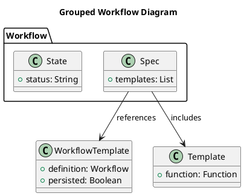
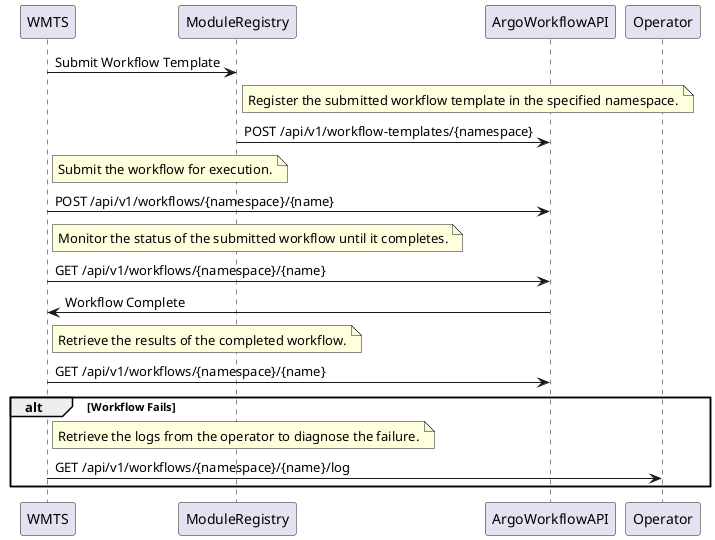
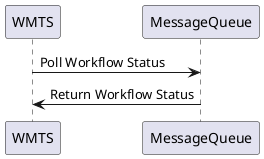

# User Manual for Argo Workflow

## Purpose of the Software

Argo Workflows is an open-source engine tailored for orchestrating workflows on Kubernetes, enabling users to define, manage, and execute tasks in containers.

## Operations Environment

Argo Workflows is executed on a Kubernetes cluster, on which it orchestrates the containers required fo executing the desired workflows.

### Hardware Configuration

Argo Workflows requires a Kubernetes cluster to operate effectively. 

## Operations Manual

### Set-up and Initialization

The set-up procedures are described in the [Installation Manual](./installation_manual.md).

### Normal Operations

The normal operations of the Argo Workflows engine are thoroughly documented on the [official Argo Workflows documentation site](https://argo-workflows.readthedocs.io/en/latest/), with detailed references to various [operational fields](https://argo-workflows.readthedocs.io/en/latest/fields/). 

The resources below aim to complement the official documentation with guidance for performing activities expected within the DimSum platform such as composing workflows, executing workflows through the REST API, and monitoring workflows with the GUI.

#### Argo Workflows Key Concepts

With Argo Workflows, three key concepts are essential: **Workflow**, **template**, and **Workflow Template**.

- **Workflow**: A structured sequence of tasks that defines the steps to be executed. It includes a specification (`spec`) of the tasks, a current status (`state`), and may reference a `WorkflowTemplate`.
- **template**: A task within a workflow that acts as a function or method.
- **Workflow Template**: A predefined definition of a workflow that can be persisted, submitted, or referenced within other workflows.



#### Workflow Composition

The [Workflow Design Manual](workflow_design_manual.md) explains the main Argo Workflows concepts and provides guidance on designing workflows that include features relevant to the platform, such as workflow templates, artefacts, and retry strategies.

#### REST API Operations

This section outlines the REST API operations executed by the DimSum platform components such as the Workflow Management System (WMTS).

The [API Design Document](design/rest_api_design.md) provides the details about the REST API operations referenced below..

The sequence of operations performed by the platform consists in the following steps: 

1. The WMTS submits the Argo Workflows Template to the Module Registry microservice.
2. The Module Registry registers the workflow template in the DimSum namespace using the Argo Workflows
3. The WMTS submits the Workflow using the REST API. 
4. The WMTS monitors the Workflow until it is complete.
5. Upon completion, the WMTS retrieves the results.
6. If the execution fails, the WMTS retrieves logs from an operator.



##### Registration of the Workflow Template

To register a workflow template, send a POST request to the Argo Workflows API with the template definition.

```sh
curl -X POST "https://your-argo-server/api/v1/workflow-templates/{namespace}" -H "Content-Type: application/json" -d '{
  "template": {
    // your workflow template JSON here
  }
}'
```

Replace `{namespace}` with your namespace and provide your workflow template JSON in the `-d` parameter.


##### Submit the Workflow

To submit the workflow for execution, send a POST request to the Argo Workflows API.

```sh
curl -X POST "https://your-argo-server/api/v1/workflows/{namespace}/{name}/submit"
```

Replace `{namespace}` with your namespace and `{name}` with the workflow name.


##### Monitor the Status

To monitor the status of the submitted workflow until it completes or get the progress and status of individual steps (tasks), send a GET request to the Argo Workflows API.

```sh
curl -X GET "https://your-argo-server/api/v1/workflows/{namespace}/{name}"
```

Replace `{namespace}` with your namespace and `{name}` with the workflow name.

The response will include detailed information about the workflow, such as:
- `status.phase`: The overall phase of the workflow (e.g., Running, Succeeded, Failed).
- `status.startedAt`: The timestamp when the workflow started.
- `status.finishedAt`: The timestamp when the workflow finished (if applicable).
- `status.nodes`: An object containing the status of each node (step) in the workflow, including:
   - `name`: The name of the node.
   - `phase`: The phase of the node (e.g., Running, Succeeded, Failed).
   - `startedAt`: The timestamp when the node started.
   - `finishedAt`: The timestamp when the node finished (if applicable).
   - `outputs`: Any outputs produced by the node.

##### Retrieve the Results

To retrieve the results of the completed workflow, send again a GET request to the Argo Workflows API when the workflow is completed.

```sh
curl -X GET "https://your-argo-server/api/v1/workflows/{namespace}/{name}"
```

Replace `{namespace}` with your namespace and `{name}` with the workflow name.

The response will include the outputs produced by the workflow, which can be found in the `status.outputs` field. This field contains:
- `artifacts`: An array of artifacts produced by the workflow, each with:
   - `name`: The name of the artifact.
   - `path`: The path where the artifact is stored.
   - `s3`: S3 bucket details if the artifact is stored in an S3 bucket.
- `parameters`: Any parameters produced by the workflow, each with:
   - `name`: The name of the parameter.
   - `value`: The value of the parameter.
   - `value`: The value of the parameter.

##### Retrieve the Logs

If the workflow execution fails, retrieve the logs to diagnose the failure by sending a GET request to the Argo Workflows API.

```sh
curl -X GET "https://your-argo-server/api/v1/workflows/{namespace}/{name}/logs"
```

Replace `{namespace}` with your namespace and `{name}` with the workflow name.


##### Manually Delete a Workflow

To manually delete a workflow, send a DELETE request to the Argo Workflows API.

```sh
curl -X DELETE "https://your-argo-server/api/v1/workflows/{namespace}/{name}"
```

Replace `{namespace}` with your namespace and `{name}` with the workflow name.

##### Suspend a Workflow

To suspend a workflow, send a PUT request to the Argo Workflows API. Suspending a workflow pauses its execution, and it can be resumed later.

```sh
curl -X PUT "https://your-argo-server/api/v1/workflows/{namespace}/{name}/suspend"
```

Replace `{namespace}` with your namespace and `{name}` with the workflow name.

##### Resume a Workflow

To resume a previously stopped or suspended workflow, send a PUT request to the Argo Workflows API.

```sh
curl -X PUT "https://your-argo-server/api/v1/workflows/{namespace}/{name}/resume"
```

Replace `{namespace}` with your namespace and `{name}` with the workflow name.


##### Stop or Terminate a Workflow

To stop a workflow, send a PUT request to the Argo Workflows API. Stopping a workflow will halt its execution but execute all exit handlers.

```sh
curl -X PUT "https://your-argo-server/api/v1/workflows/{namespace}/{name}/stop"
```

Replace `{namespace}` with your namespace and `{name}` with the workflow name.


To terminate a workflow, send a PUT request to the Argo Workflows API. Terminating a workflow immediately stops its execution and marks it as terminated. Exit handlers are not executed.

```sh
curl -X PUT "https://your-argo-server/api/v1/workflows/{namespace}/{name}/terminate"
```

Replace `{namespace}` with your namespace and `{name}` with the workflow name.


##### List the Workflow Templates

To list all workflow templates, send a GET request to the Argo Workflows API.

```sh
curl -X GET "https://your-argo-server/api/v1/workflow-templates/{namespace}"
```

Replace `{namespace}` with your namespace. This will return a list of all registered workflow templates.

##### Retrieve a Workflow Template

To retrieve a specific workflow template, send a GET request to the Argo Workflows API.

```sh
curl -X GET "https://your-argo-server/api/v1/workflow-templates/{namespace}/{template-name}"
```

Replace `{namespace}` with your namespace and `{template-name}` with the name of the workflow template you want to retrieve.

By following these instructions, you can effectively manage your workflows using the Argo Workflow REST API.
```

##### Workflow Notifications

Argo Workflows does not natively support notification mechanisms for status updates, except through implementing a custom container in an exit handler to handle such notifications. However, this functionality can be considered in phase 2 of the project.


See [Workflow Notifications Documentation](https://argo-workflows.readthedocs.io/en/latest/workflow-notifications/) for additional details.

#### GUI Operations

This section provides instructions on how to perform various operations using the Argo Workflow GUI.

#### List Workflows (Running or Complete)

1. Open the Argo Workflows GUI.
2. Navigate to the "Workflows" tab.
3. Here, you will see a list of all workflows, including both running and completed ones.
4. You can use filters to refine the list based on workflow status, name, and other criteria.

#### Display Workflow Status

1. In the Argo Workflows GUI, navigate to the "Workflows" tab.
2. Click on the workflow for which you want to view the status.
3. The workflow details page will open, displaying the current status at the top (e.g., Running, Succeeded, Failed).

#### Monitor Workflow Steps

1. From the workflow details page in the Argo Workflows GUI, you can see the graphical representation of the workflow.
2. Each step in the workflow is displayed as a node in the graph.
3. Click on any node to view the details of that step, including logs, outputs, and the current status.

#### Retrieve Workflow Logs

1. In the workflow details page, click on the specific node (step) you are interested in.
2. A sidebar will appear showing details about that step.
3. Click on the "Logs" tab in the sidebar to view the logs for that specific step.

#### Retrieve Workflow Outputs

1. Navigate to the workflow details page in the Argo Workflows GUI.
2. At the bottom of the page, you will see a section labeled "Outputs."
3. This section lists the outputs produced by the workflow. You can click on each output to view more details or download the data.

#### Manually Delete a Workflow

1. Open the Argo Workflows GUI and navigate to the "Workflows" tab.
2. Find the workflow you want to delete in the list.
3. Click the three-dot menu (ellipsis) next to the workflow.
4. Select "Delete" from the dropdown menu.
5. Confirm the deletion in the prompt that appears.

### Normal Termination

To cease or interrupt the use of Argo Workflow, users can terminate their workflows through the Argo REST API or Argo UI. Using the Argo REST API, users can send a POST request to the `/api/v1/workflows/{namespace}/{name}/terminate` endpoint to terminate a workflow or to the `/api/v1/workflows/{namespace}/{name}/stop` endpoint to stop a workflow. Additionally, the Argo UI provides an intuitive interface to manage and halt workflows.

To verify if the termination has been normal, users should check the status of the workflow. A normally terminated workflow will have a status of `Succeeded` or `Failed`, indicating that the workflow has completed its execution or encountered an error during the process. Users can inspect the workflow status via the Argo REST API by sending a GET request to the `/api/v1/workflows/{namespace}/{name}` endpoint or through the Argo UI.

#### Example: Terminate a Workflow Using REST API

To terminate a workflow named `example-workflow` in the `default` namespace, users can send the following POST request:

```sh
curl -X POST "https://your-argo-server/api/v1/workflows/default/example-workflow/terminate"
```

#### Example: Check Workflow Status Using REST API
To check the status of a workflow named example-workflow in the default namespace, users can send the following GET request:

```sh
curl -X GET "https://your-argo-server/api/v1/workflows/default/example-workflow"
```` 


### Error Conditions

Common error conditions in Argo Workflows include:

1. **Workflow Fails to Start**: This may be due to incorrect workflow definitions or missing dependencies. Detection methods include checking the Argo CLI or UI for error messages indicating validation issues.

   **Troubleshooting Steps**:
  - Verify the workflow YAML file for syntax errors.
  - Ensure all required parameters and artifacts are correctly defined.
  - Use the `argo lint` command to validate the workflow definition.

2. **Pod Failures**: Pods may fail to start or run due to resource constraints, image pull errors, or misconfigurations. Detection involves monitoring pod status in the Kubernetes dashboard or using the Argo CLI.

   **Troubleshooting Steps**:
  - Check pod logs using `kubectl logs <pod-name>` for detailed error messages.
  - Ensure the container images are accessible and correctly specified.
  - Verify resource requests and limits to ensure the cluster can accommodate the pod.

3. **Timeouts**: Workflows or specific steps may time out if they exceed the allotted execution time. Detection methods include checking the workflow status for timeout errors.

   **Troubleshooting Steps**:
  - Review and adjust the timeout settings in the workflow definition.
  - Optimize the workflow steps to reduce execution time.
  - Ensure external services or dependencies are responsive and not causing delays.

4. **Permission Denied Errors**: These errors occur when the workflow does not have the necessary permissions to perform certain actions. Detection involves examining the error messages related to access issues.

   **Troubleshooting Steps**:
  - Verify the service account permissions and roles assigned to the workflow.
  - Update the role-based access control (RBAC) settings to grant the required permissions.
  - Check and correct any file or directory permissions within the workflow.

5. **Resource Quota Exceeded**: Workflows may fail if they exceed the assigned resource quotas in the cluster. Detection involves checking for resource-related error messages in the workflow status.

   **Troubleshooting Steps**:
  - Review the resource quotas assigned to the namespace and adjust if necessary.
  - Optimize workflow resource usage to stay within the quota limits.
  - Consult with the cluster administrator to request increased resource allocations if needed.


### Recover Runs

In the event of workflow failures or interruptions, Argo Workflows provides mechanisms to restart or recover runs, ensuring continuity and minimizing downtime.

1. **Retry Failed Steps**: Argo allows users to retry failed steps within a workflow. This can be configured in the workflow YAML by specifying the `retryStrategy`. Users can define the number of retries and the backoff strategy.

   **Procedure**:
  - Edit the workflow definition to include a `retryStrategy` for the relevant steps.
  - Resubmit the workflow using the `argo submit` command with the updated YAML file.

2. **Resume Suspended Workflows**: If a workflow is manually or automatically suspended, it can be resumed using the Argo CLI.

   **Procedure**:
  - Use the `argo resume <workflow-name>` command to resume a suspended workflow.
  - Verify the workflow status to ensure it continues from the point of suspension.

3. **Resubmit Failed Workflows**: Entire workflows that have failed can be resubmitted. This can be useful if the failure was due to transient issues or if changes have been made to the environment.

   **Procedure**:
  - Identify the failed workflow using the `argo list` command.
  - Resubmit the workflow using the `argo resubmit <workflow-name>` command.
  - Monitor the workflow status to ensure it runs to completion.

4. **Workflow Archiving and Retrieval**: Argo Workflows can be configured to archive completed workflows. Archived workflows can be retrieved and resubmitted if needed.

   **Procedure**:
  - Ensure workflow archiving is enabled in the Argo configuration.
  - Retrieve archived workflows using the `argo archive get <workflow-name>` command.
  - Resubmit the archived workflow using the `argo submit` command.

5. **Handling Emergency Situations**: In emergencies, such as cluster failures or critical resource shortages, maintaining workflow continuity is crucial.

   **Procedure**:
  - Implement backup and restore strategies for the Argo Workflows controller and associated databases.
  - Utilize high-availability (HA) configurations for critical components to minimize downtime.
  - Regularly test disaster recovery plans to ensure workflows can be recovered quickly.

## Tutorials

The following tutorials are provided for testing purposes to facilitate the learning of Argo Workflows:

* [CLI Tutorial](tutorial_cli.md): Offers a brief overview of the main operations of the Argo CLI, a command-line interface that allows users to manage and interact with their workflows efficiently.
* [REST API Tutorial](tutorial_rest.md): Demonstrates how to interact with the Argo Workflows through REST API calls, providing examples of common operations such as submitting, monitoring, and managing workflows.
* [GUI Tutorial](tutorial_gui.md): Guides users through the graphical user interface of Argo Workflows, showcasing how to visually design, manage, and monitor workflows using the web-based interface.
