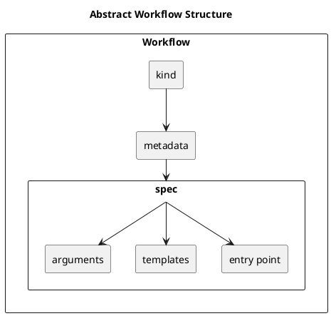

# Workflow Design Manual

## Workflow Structure

A **Workflow** is composed of several key components:

- **kind**: Defines the type or category of the workflow.
- **metadata**: Contains metadata information about the workflow, such as name, namespace, labels, and annotations.
- **spec**: The specification of the workflow, which includes detailed definitions of the workflow's behavior and structure.
    - **entrypoint**: The starting point or main task of the workflow.
    - **templates**: A collection of tasks or functions to be executed within the workflow.
    - **arguments**: Parameters or inputs required for the workflow to execute.



## Templates Structure

In the context of a Workflow, the `templates` section defines the tasks to be executed. Each template can have the following components:

- **name**: The name of the template. This is a unique identifier for the template within the workflow.
- **inputs**: (Optional) Specifies the inputs required by the template. This can include parameters, artifacts, and other input resources.
- **outputs**: (Optional) Specifies the outputs produced by the template. This can include parameters, artifacts, and other output resources.
- **type**: (Optional) Indicates the type of template. Common types include:
    - `container`: Specifies a container to run.
    - `steps`: Defines a set of sequential or parallel steps to be executed.
    - `dag`: Defines a Directed Acyclic Graph of tasks, allowing more complex workflows.
    - `resource`: Manages Kubernetes resources as part of the workflow.
    - `script`: Executes a script.

The following example shows the details of the container template with inputs and outputs.

```yaml
templates:
  - name: whalesay
    container:
      image: docker/whalesay
      command: [ cowsay ]
      args: [ "hello world" ]
    inputs:
      parameters:
        - name: message
          value: "hello world"
    outputs:
      artifacts:
        - name: output
          path: /path/to/output
```

In this example, the whalesay template is of type container. It specifies the container image, command, and arguments to run. The template also defines an input parameter (message) and an output artifact (output).

## Workflow Parameter and Argument

It is important to understand the distinction between parameters and arguments:

- **Input Parameter**: This is a definition of the inputs required by a task or function. For example, in a function definition `addFour(int a) {}`, `a` is an input parameter.
- **Output Parameter**: This is a definition of the output produced by a task or function. For example, in a function definition `int addFour(…) {}`, the function returns an integer, which is an output parameter.
- **Argument**: This is the actual value provided to a parameter when a task or function is executed. For instance, if you call the function `addFour(4)`, the value `4` is the argument.

The following example demonstrates how input parameters and arguments are used within a workflow:

```yaml
spec:
  entrypoint: whalesay
  arguments:
    parameters:
      - name: message
        value: hello world
  templates:
    - name: whalesay
      inputs:
        parameters:
          - name: message
      container:
        image: docker/whalesay
        command: [ cowsay ]
        args: [ "{{inputs.parameters.message}}" ]
```

In this example:

- The `arguments` section at the `spec` level provides live parameter values. Here, the parameter named `message` is given the value `"hello world"`.
- The `templates` section defines a template named `whalesay`. This template has an input parameter named `message`.
- Within the container specification, the command to be run (`cowsay`) uses the argument provided to the `message` parameter (`"hello world"`), which is referenced as `{{inputs.parameters.message}}`.


## WorkflowTemplate

A **WorkflowTemplate** is a reusable definition of a workflow that can be registered, persisted, and referenced by other workflows. This template defines a workflow's structure and behavior, making it possible to standardize and reuse workflow definitions across multiple workflows.

Key Components:

- **entrypoint**: The main task or starting point of the workflow. This defines the initial action to be executed when the workflow starts.
- **inputs**: Parameters required by the entrypoint. These parameters define what inputs are necessary for the workflow to run.
- **outputs**: Parameters produced by the entrypoint. These parameters define the results or outputs generated by the workflow.

The entrypoint, along with its input and output parameters, defines the external interface of the registerable `WorkflowTemplate`. This interface specifies what inputs are needed and what outputs will be produced, making it possible for other workflows to interact with this template.

Below is a very basic example of a workflow template which defines an input parameter `message` which is passed as argument to the container `cowsay`:

```yaml
apiVersion: argoproj.io/v1alpha1
kind: WorkflowTemplate
metadata:
  name: my-template
spec:
  entrypoint: whalesay-template
  templates:
    - name: whalesay-template
      inputs:
        parameters:
          - name: message
      container:
        image: docker/whalesay
        command: [cowsay]
        args: ["{{inputs.parameters.message}}"]]
```

When a workflow references a `WorkflowTemplate`, it must provide the required parameter values as arguments. This ensures that all necessary inputs are available for the workflow to execute correctly.

### Composition with a Single WorkflowTemplate

In the example below, the above WorkflowTemplate `my-template` is called with `from workflow`as argument of the message parameter:

```yaml
apiVersion: argoproj.io/v1alpha1
kind: Workflow
metadata:
  generateName: hello-world
spec:
  arguments:
    parameters:
      - name: message
        value: "from workflow“
  workflowTemplateRef:
    name: my-template

```

### Composition with Multiple WorkflowTemplates

In more complex scenarios, you may need to compose workflows that leverage multiple `WorkflowTemplates`. This allows for modular design, enabling you to build sophisticated workflows by reusing and combining smaller, well-defined templates. Here's how you can compose workflows using multiple `WorkflowTemplates`.

In this example, two `WorkflowTemplates`, `workflowtemplate-1` and `workflowtemplate-2`, are executed sequentially. The output of the first template can be passed as input to the second template.

**Workflow Composition:**

```yaml
apiVersion: argoproj.io/v1alpha1
kind: Workflow
metadata:
  generateName: composed-workflow-
spec:
  entrypoint: composed-entrypoint
  templates:
    - name: composed-entrypoint
      steps:
        - - name: call-template-one
            templateRef:
              name: workflowtemplate-1
              template: step-one
            arguments:
              parameters:
                - name: input-param
                  value: "input for template one"
        - - name: call-template-two
            templateRef:
              name: workflowtemplate-2
              template: step-two
            arguments:
              parameters:
                - name: input-param
                  value: "{{steps.call-template-one.outputs.parameters.output-param}}"
```

In this example, `call-template-one` executes first, and its output is used as the input for `call-template-two`.


## Managing Artefacts.

WorkflowTemplates in Argo Workflows can define input and output artefacts to facilitate data management within workflows. An artefact in Argo Workflows can be either a file or a directory.

- **Input Artefacts**: Allow workflows to receive data from external sources, which can be used as input for various tasks within the workflow.
- **Output Artefacts**: Enable workflows to produce and store data generated during execution, making it available for subsequent tasks or external systems.

```yaml
apiVersion: argoproj.io/v1alpha1
kind: WorkflowTemplate
metadata:
  name: my-template
spec:
  entrypoint: whalesay-template
  templates:
    - name: whalesay-template
      inputs:
        artifacts:
          - name: input-data
            path: /tmp/input-file
      outputs:
        artifacts:
          - name: output-file
            path: /tmp/output-file.txt
      container:
        image: docker/whalesay
        command: [ sh, -c ]
        args: ["ls -lh /tmp/input-file >> /tmp/output-file.txt"]
```

This workflow template is designed to:

1. Accept an input artifact (input-data) and place it at /tmp/input-file inside the container.
2. Execute a command inside a container using the docker/whalesay image.
3. The command lists the contents of the input file in a detailed format and appends this listing to an output file located at /tmp/output-file.txt.
4. The resulting file (/tmp/output-file.txt) is then made available as an output artifact (output-file).

##### Workflow Input Artefact 

The concept of artefacts in WorkflowTemplates abstracts away the specifics of where an artefact is provided. This means that the WorkflowTemplate does not need to know or manage the details of the artefact's storage or retrieval. 

Instead, when a workflow calls a template, it should define the source of the artefact using various supported protocols such as S3, HTTP, or other storage systems.

```yaml
apiVersion: argoproj.io/v1alpha1
kind: Workflow
metadata:
  generateName: hello-world
spec:
  arguments:
    parameters:
      - name: message
        value: "from workflow“
    artifacts:
      - name: input-data
        s3:
          key: “/data/input.gzarr”
  workflowTemplateRef:
    name: my-template
```

##### Artefacts Flow between Steps

Argo Workflows allows you to use the output of one step as the input to another step within the same workflow.

The example below demonstrates how to pass an artefact between steps in an Argo Workflow: 

```yaml
apiVersion: argoproj.io/v1alpha1
kind: WorkflowTemplate
spec:
  templates:
    steps:
    - - name: step-1
        template: step-1-template
    - - name: step-2
        template: step-2-template
        arguments:
          artifacts:
            - name: message
              from: "{{steps.step-1.outputs.artifacts.hello-artefact}}"
```

* In the first step (step-1), an output artefact named `hello-artefact` is generated. The template `step-1 -template` (not provided in the example) is expected to generate this artefact. 
* The second step (step-2) references this output artefact as its input, using the from field to specify the source of the artefact from the previous step. This allows the workflow to use the data produced by step-1 in step-2.

##### Artefact Storage Configuration

The default artefact repository in Argo Workflows is a pre-configured storage location where artefacts are stored and retrieved if no specific storage location is provided. This repository simplifies the configuration of workflows by providing a common, centralised storage solution for artefacts. 

###### Key Only Artifacts


* A key-only artefact is an input or output artefact where you only specify the key, omitting the bucket, secrets, etc. When these parameters are omitted, the default bucket and secrets from the configured artefact repository are used. 
* When you don't specify even a key for an output artefact, Argo Workflows store the output with a system-generated key based on the workflow name, node name, and artefact name to ensure uniqueness.

> IMPORTANT: Consider parameterising your S3 keys by {{workflow.uid}} if there's a possibility that you could have concurrent Workflows of the same spec. This would be to avoid a scenario in which the artifact from one Workflow is being deleted while the same S3 key is being generated for a different Workflow.


###### S3 Configuration Parameters


You can provide specific **S3 configuration parameters** to customize where and how the artifact is stored. The parameters include:

- **endpoint**: Specifies the S3 service URL. This is the address of the S3-compatible storage service.
- **bucket**: Defines the specific S3 bucket where the artifact will be stored. Buckets are containers for storing objects (files).
- **key**: Sets the unique path within the bucket for the artifact. This key is a string that identifies the object in the bucket.
- **accessKeySecret**: Provides the access key for the S3 bucket. This is retrieved from a Kubernetes secret.
- **secretKeySecret**: Provides the secret key for the S3 bucket. This is also retrieved from a Kubernetes secret.

Example Configuration:

```yaml
artifacts:
  - name: my-artifact
    s3:
      endpoint: s3.amazonaws.com
      bucket: my-bucket
      key: path/to/artifact
      accessKeySecret:
        name: my-s3-secret
        key: accessKey
      secretKeySecret:
        name: my-s3-secret
        key: secretKey
``` 

###### HTTP/HTTPS

Argo Workflows can retrieve artifacts from HTTP/HTTPS endpoints.

- **url**: The URL from which the artifact can be downloaded.

Example Configuration:

```yaml
artifacts:
  - name: my-artifact
    http:
      url: https://example.com/path/to/artifact
```

###### Git

Argo Workflows supports retrieving artifacts from Git repositories.

- **repo**: The URL of the Git repository.
- **revision**: The specific commit SHA, tag, or branch to checkout.
- **sshPrivateKeySecret**: The SSH private key used to access the repository.

Example Configuration:

```yaml
artifacts:
  - name: my-artifact
    git:
      repo: git@github.com:my/repo.git
      revision: main
      sshPrivateKeySecret:
        name: my-git-secret
        key: sshPrivateKey
```

##### Workflow Output Artefact

When a workflow needs to expose an artifact on a particular S3 bucket and key, it is expected to call a publication step. This step will handle the actual publishing of the artifact to the designated S3 bucket. 

The publication step receives the key from a configured secret:

```yaml
outputs:
  artifacts:
    - name: result
      s3:
        endpoint: s3.custom-endpoint.com
        bucket: custom-bucket
        key: custom-path/to/output.txt
        accessKeySecret:
          name: custom-s3-secret
          key: accessKey
        secretKeySecret:
          name: custom-s3-secret
          key: secretKey
```

#### Creating DAG

The workflow Template is as follows:
```yaml
apiVersion: argoproj.io/v1alpha1
kind: WorkflowTemplate
metadata:
  name: dag-template
spec:
  entrypoint: gdal-manipulation
  nodeSelector:
    accelerator: "example-gpu"
  templates:
    - name: gdal-manipulation
      podSpecPatch: '{"containers":[{"name":"main", "resources":{"requests":{"memory": "100M" }}}]}'
      retryStrategy:
        limit: "10"
      inputs:
        parameters:
          - name: image-url
          - name: export-key
      outputs:
        artifacts:
          - name: result
            globalName: result
            from: "{{tasks.stage-out.outputs.artifacts.result}}"
      dag:
        tasks:
          - name: gdal-translate
            templateRef:
              name: gdal-translate-template
              template: gdal-translate
            arguments:
              artifacts:
                - name: input-dataset
                  http:
                    url: "{{inputs.parameters.image-url}}"
          - name: gdal-info
            dependencies: [gdal-translate]
            templateRef:
              name: gdal-info-template
              template: gdal-info
            arguments:
              artifacts:
                - name: input-dataset
                  from: "{{tasks.gdal-translate.outputs.artifacts.processed-dataset}}"
          - name: stage-out
            dependencies: [gdal-info]
            templateRef:
              name: stage-out-template
              template: stage-out
            arguments:
              parameters:
                - name: export-key
                  value: "{{inputs.parameters.export-key}}"
              artifacts:
                - name: artifact-to-export
                  from: "{{tasks.gdal-translate.outputs.artifacts.processed-dataset}}"
```

See: [Example](../examples/dag-complete/dag-template.yml)

This template defines a Direct Acyclic Graph (DAG), each task re-using a workflow template:
1. GDAL Translate: Used to append metadata to a file [Template](../examples/dag-complete/gdal-translate-template.yml)
2. GDAl Info: used to generate a report concernin the file modified in task 1. [Template](../examples/dag-complete/gdal-info-template.yml)
3. Stage OUT: use to stage out the file modified in task 1.[Template](../examples/dag-complete/stage-out-template.yml)

The first tak argument is an artifact of type HTTP artifact. The url is provided in the Workflow definition:
```yaml
apiVersion: argoproj.io/v1alpha1
kind: Workflow
metadata:
  generateName: dag-workflow-
spec:
  arguments:
    parameters:
      - name: image-url
        value: https://dagshub.com/DagsHub-Datasets/sentinel-2-l2a-cogs-dataset/raw/e9420f518fa204e0b3665bf66aba30ba38449c2b/s3:/sentinel-cogs/sentinel-s2-l2a-cogs/1/C/CV/2024/1/S2B_1CCV_20240106_0_L2A/B01.tif
      - name: export-key
        value: result.tif
  workflowTemplateRef:
    name: dag-template
```
See: [Workflow Example](../examples/dag-complete/dag-http-wf.yml)


