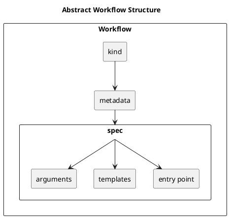
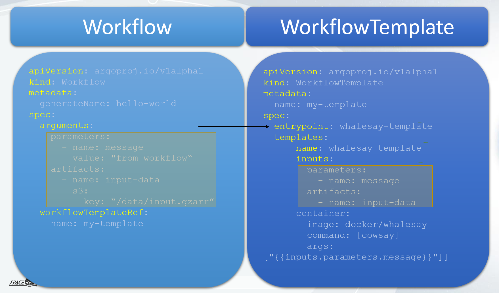

##### Workflow Structure

A **Workflow** is composed of several key components:

- **kind**: Defines the type or category of the workflow.
- **metadata**: Contains metadata information about the workflow, such as name, namespace, labels, and annotations.
- **spec**: The specification of the workflow, which includes detailed definitions of the workflow's behavior and structure.
    - **entrypoint**: The starting point or main task of the workflow.
    - **templates**: A collection of tasks or functions to be executed within the workflow.
    - **arguments**: Parameters or inputs required for the workflow to execute.




##### Templates Structure

In the context of a Workflow, the `templates` section defines the tasks to be executed. Each template can have the following components:

- **name**: The name of the template. This is a unique identifier for the template within the workflow.
- **inputs**: (Optional) Specifies the inputs required by the template. This can include parameters, artifacts, and other input resources.
- **outputs**: (Optional) Specifies the outputs produced by the template. This can include parameters, artifacts, and other output resources.
- **type**: (Optional) Indicates the type of template. Common types include:
    - `container`: Specifies a container to run.
    - `steps`: Defines a set of sequential or parallel steps to be executed.
    - `dag`: Defines a Directed Acyclic Graph of tasks, allowing more complex workflows.
    - `resource`: Manages Kubernetes resources as part of the workflow.
    - `script`: Executes a script.

The following example shows the details of the container template with inputs and outputs.

```yaml
templates:
  - name: whalesay
    container:
      image: docker/whalesay
      command: [ cowsay ]
      args: [ "hello world" ]
    inputs:
      parameters:
        - name: message
          value: "hello world"
    outputs:
      artifacts:
        - name: output
          path: /path/to/output
```

In this example, the whalesay template is of type container. It specifies the container image, command, and arguments to run. The template also defines an input parameter (message) and an output artifact (output).

##### Workflow Parameter and Argument

It is important to understand the distinction between parameters and arguments:

- **Input Parameter**: This is a definition of the inputs required by a task or function. For example, in a function definition `addFour(int a) {}`, `a` is an input parameter.
- **Output Parameter**: This is a definition of the output produced by a task or function. For example, in a function definition `int addFour(…) {}`, the function returns an integer, which is an output parameter.
- **Argument**: This is the actual value provided to a parameter when a task or function is executed. For instance, if you call the function `addFour(4)`, the value `4` is the argument.

The following example demonstrates how input parameters and arguments are used within a workflow:

```yaml
spec:
  entrypoint: whalesay
  arguments:
    parameters:
      - name: message
        value: hello world
  templates:
    - name: whalesay
      inputs:
        parameters:
          - name: message
      container:
        image: docker/whalesay
        command: [ cowsay ]
        args: [ "{{inputs.parameters.message}}" ]
```

In this example:

- The `arguments` section at the `spec` level provides live parameter values. Here, the parameter named `message` is given the value `"hello world"`.
- The `templates` section defines a template named `whalesay`. This template has an input parameter named `message`.
- Within the container specification, the command to be run (`cowsay`) uses the argument provided to the `message` parameter (`"hello world"`), which is referenced as `{{inputs.parameters.message}}`.


##### WorkflowTemplate

A **WorkflowTemplate** is a reusable definition of a workflow that can be registered, persisted, and referenced by other workflows. This template defines a workflow's structure and behavior, making it possible to standardize and reuse workflow definitions across multiple workflows.

Key Components:

- **entrypoint**: The main task or starting point of the workflow. This defines the initial action to be executed when the workflow starts.
- **inputs**: Parameters required by the entrypoint. These parameters define what inputs are necessary for the workflow to run.
- **outputs**: Parameters produced by the entrypoint. These parameters define the results or outputs generated by the workflow.

##### External Interface

The entrypoint, along with its input and output parameters, defines the external interface of the registerable `WorkflowTemplate`. This interface specifies what inputs are needed and what outputs will be produced, making it possible for other workflows to interact with this template.

When a workflow references a `WorkflowTemplate`, it must provide the required parameter values as arguments. This ensures that all necessary inputs are available for the workflow to execute correctly.




#### Managing Artefacts.

Requirements:
- This tutorial requires that your argo workflow installation uses a default artifact repository (see the [installation manual](installation_manual.md) for more information on this)
- It also requires that a bucket named 'test' is presetn at the root of your artifact repository (S3 storage).

This tutorial covers how we can consume and produce artifacts in a workflow.
For this purpose, we will use the artifact-consumer example located in [examples/artifact/consumer](../examples/artifact-consumer)

The workflow Template is as follows:
```yaml
apiVersion: argoproj.io/v1alpha1
kind: WorkflowTemplate
metadata:
  name: artifact-consumer-wft
spec:
  entrypoint: process-artifact
  templates:
    - name: process-artifact
      inputs:
        parameters:
          - name: source-path
          - name: target-path
        artifacts:
          - name: input-file
            path: /tmp/input-file
            s3:
              bucket: test
              key: "{{inputs.parameters.source-path}}"
      outputs:
        artifacts:
          - name: output-file
            path: /tmp/output-file.txt
            archive:
              none: { }
            s3:
              key: "{{inputs.parameters.target-path}}"
      container:
        image: docker/whalesay
        command: [ sh, -c ]
        args: ["ls -lh /tmp/input-file >> /tmp/output-file.txt"]
```
See: [examples/artifact/consumer/artifact-consumer-wf-template.yml](../examples/artifact-consumer/artifact-consumer-wf-template.yml)

This workflow template defines an input artifact, which references a bucket 'test' and the key is provided as a parameter.
```yaml
artifacts:
          - name: input-file
            path: /tmp/input-file
            s3:
              bucket: test
              key: "{{inputs.parameters.source-path}}"
```


It also defines an output artifact, which key is also provided as a parameter:
```yaml
artifacts:
          - name: output-file
            path: /tmp/output-file.txt
            archive:
              none: { }
            s3:
              key: "{{inputs.parameters.target-path}}"
```

The first step, is to register this workflow template:
```
argo -n <k8s-namespace> template create examples/artifact-consumer/artifact-consumer-wf-template.yml
```

After registering the workflow template, we can submit a workflow.
This workflow will have to define the key used for the input (source-path) and output (target-path) artifacts.
```yaml
apiVersion: argoproj.io/v1alpha1
kind: Workflow
metadata:
  generateName: artifact-consumer-wft-
spec:
  arguments:
    parameters:
      - name: source-path
        value: lorem.txt # The specific key for the S3 input object
      - name: target-path
        value: result.txt # The specific key where the S3 output object will be written

  # Reference the WorkflowTemplate
  workflowTemplateRef:
    name: artifact-consumer-wft
```
See: [examples/artifact/consumer/artifact-consumer-wf.yml](../examples/artifact-consumer/artifact-consumer-wf.yml)

Submit the workflow for execution with the following command:
```
argo -n <k8s-namespace> submit examples/artifact-consumer/artifact-consumer-wf.yml
```

To monitor the workflow execution progress, use the same commands as in the basic tutorial.

#### Creating DAG

The workflow Template is as follows:
```yaml
apiVersion: argoproj.io/v1alpha1
kind: WorkflowTemplate
metadata:
  name: dag-template
spec:
  entrypoint: gdal-manipulation
  nodeSelector:
    accelerator: "example-gpu"
  templates:
    - name: gdal-manipulation
      podSpecPatch: '{"containers":[{"name":"main", "resources":{"requests":{"memory": "100M" }}}]}'
      retryStrategy:
        limit: "10"
      inputs:
        parameters:
          - name: image-url
          - name: export-key
      outputs:
        artifacts:
          - name: result
            globalName: result
            from: "{{tasks.stage-out.outputs.artifacts.result}}"
      dag:
        tasks:
          - name: gdal-translate
            templateRef:
              name: gdal-translate-template
              template: gdal-translate
            arguments:
              artifacts:
                - name: input-dataset
                  http:
                    url: "{{inputs.parameters.image-url}}"
          - name: gdal-info
            dependencies: [gdal-translate]
            templateRef:
              name: gdal-info-template
              template: gdal-info
            arguments:
              artifacts:
                - name: input-dataset
                  from: "{{tasks.gdal-translate.outputs.artifacts.processed-dataset}}"
          - name: stage-out
            dependencies: [gdal-info]
            templateRef:
              name: stage-out-template
              template: stage-out
            arguments:
              parameters:
                - name: export-key
                  value: "{{inputs.parameters.export-key}}"
              artifacts:
                - name: artifact-to-export
                  from: "{{tasks.gdal-translate.outputs.artifacts.processed-dataset}}"
```

See: [Example](../examples/dag-complete/dag-template.yml)

This template defines a Direct Acyclic Graph (DAG), each task re-using a workflow template:
1. GDAL Translate: Used to append metadata to a file [Template](../examples/dag-complete/gdal-translate-template.yml)
2. GDAl Info: used to generate a report concernin the file modified in task 1. [Template](../examples/dag-complete/gdal-info-template.yml)
3. Stage OUT: use to stage out the file modified in task 1.[Template](../examples/dag-complete/stage-out-template.yml)

The first tak argument is an artifact of type HTTP artifact. The url is provided in the Workflow definition:
```yaml
apiVersion: argoproj.io/v1alpha1
kind: Workflow
metadata:
  generateName: dag-workflow-
spec:
  arguments:
    parameters:
      - name: image-url
        value: https://dagshub.com/DagsHub-Datasets/sentinel-2-l2a-cogs-dataset/raw/e9420f518fa204e0b3665bf66aba30ba38449c2b/s3:/sentinel-cogs/sentinel-s2-l2a-cogs/1/C/CV/2024/1/S2B_1CCV_20240106_0_L2A/B01.tif
      - name: export-key
        value: result.tif
  workflowTemplateRef:
    name: dag-template
```
See: [Workflow Example](../examples/dag-complete/dag-http-wf.yml)


